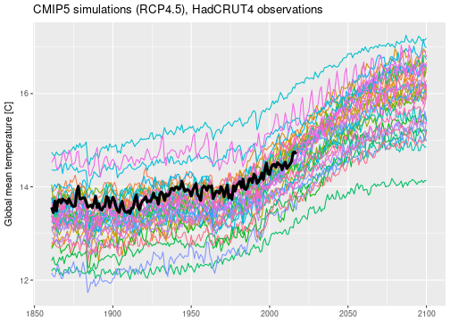
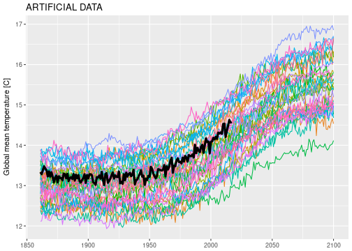
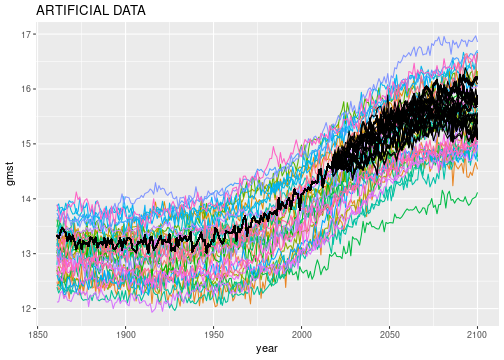
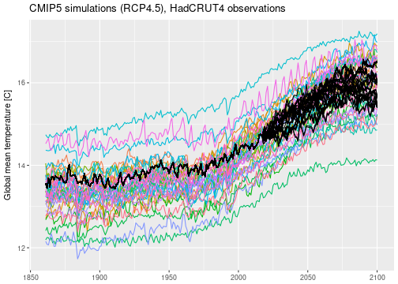
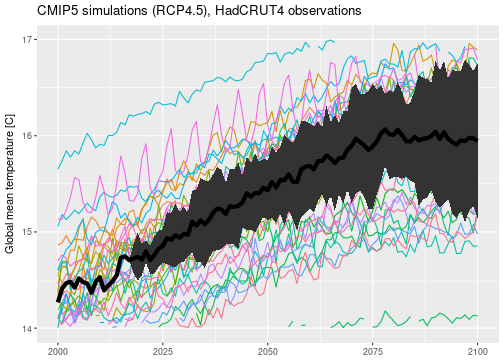

# Global mean surface temperature projection

*Last update: 25 September 2017*


```r
suppressPackageStartupMessages(library(INLA))
suppressPackageStartupMessages(library(tidyverse))
knitr::opts_chunk$set(
  cache.path='_knitr_cache/global-temperature/',
  fig.path='figure/global-temperature/'
)
```

- [CMIP5][a-cmip5]
- "Coupled Model Intercomparison Project"
- coordinated climate model experiments
- [data access][a-cmip5-data]
- annually and globally averaged surface temperatures
- RCP4.5 (representative concentration pathway), moderate emissions, "realistic"


- [HadCRUT4 data download][a-hadcrut]
- global, annual time series
- 100 member median
- ignoring the uncertainty information provided


[a-cmip5]: http://cmip-pcmdi.llnl.gov/cmip5/index.html
[a-cmip5-data]: http://cmip-pcmdi.llnl.gov/cmip5/data_getting_started.html
[a-hadcrut]: https://www.metoffice.gov.uk/hadobs/hadcrut4/data/current/download.html




I'm not sure whether or not I'm allowed to publish the raw CMIP5 data here, which means that I am probably not.
So I simulated some artificial data to work with that looks similar to the real CMIP5 global temperature projections.
You can find the simulation code in the [repository](https://www.github.com/sieste/inla-project), file `global-temperature.Rmd`, code block `simulate-data`.


The simulated data is saved in the `data` directory, and here is the psychedelic spaghetti plot:


```r
load('data/gmst_sim.Rdata')
ggplot() + 
  geom_line(data=gmst_mod_sim, aes(x=year, y=gmst, color=model)) + 
  geom_line(data=gmst_obs_sim, aes(x=year, y=gmst), lwd=1.5, na.rm=TRUE) +
  theme(legend.position = 'none') +
  labs(x=NULL, y='Global mean temperature [C]', color=NULL) + 
  ggtitle('ARTIFICIAL DATA')
```



The Rougier et al (2013) framework for exchangeable model runs and co-exchangeable observations.

- common mean 
- independent residuals
- discrepancy

\begin{equation}
X_{i,t} = M_t + R_{i,t}
\end{equation}

\begin{equation}
Y_{t} = A M_t + U_{t}
\end{equation}

\begin{equation}
Z = H Y + W
\end{equation}

How should we model this data?

**common mean** 

- highly constrained by the model runs, could just use the ensemble mean
- but want to integrate this into the inference with INLA
- model as a non-stationary random process with temporal correlation
- random walk with constant variance of increments 


**residuals**

- constant offset
- AR1 process
- random walk drift

**discrepancy**

- will assume that $var(U) = var(R)$ and $E(U) = 0$
- observations are exchangeable with model runs

### R-INLA


```r
inla_formula = gmst ~ 
                 -1 + 
                 f(i1, model='rw1') +                  
                 f(i2, model='iid', replicate=repl) +  
                 f(i3, model='ar1', replicate=repl) + 
                 f(i4, model='rw1', replicate=repl, 
                       prior='loggamma', param=c(25, .25))

inla_data = 
  gmst_mod_sim %>%
  bind_rows(
    gmst_obs_sim %>% 
    bind_rows(data_frame(year=2018:2100, gmst=NA_real_)) %>%
    mutate(model = 'obs')
  ) %>%
  mutate(model = as.factor(model)) %>%
  mutate(i1 = year) %>%
  mutate(i2 = 1L) %>%
  mutate(i3 = year) %>%
  mutate(i4 = year) %>%
  mutate(repl = as.integer(model))
```


We can now fire up INLA.
We tell INLA that our observations are "perfect" via `family='gaussian'` with very high precision. 
We also set `config=TRUE` to be able to simulate from the posterior later on.


```r
inla_result = inla(formula=inla_formula, data=inla_data, family='gaussian', 
              control.family=list(initial=12, fixed=TRUE),
              control.compute=list(config=TRUE))
```

The code takes about a minute to run on my laptop, so in this case INLA does not feel as lightning fast as it is sometimes advertised.
On the other hand, inferring this model using MCMC would probably take hours.

Now we sample from the posteriors, using the function `inla.posterior.sample()`.
I am not 100 percent sure what is going on under the hood of this function.
For example, I don't know what algorithm is used to draw the samples.
The help file isn't terribly enlightening.
But after looking at the results further down I think it is doing something reasonable.


```r
set.seed(23)
inla_sampls = inla.posterior.sample(n=100, result=inla_result, seed=42) 
```

The output is a list of length 100 (number of samples).
Each sample creates a list with elements `hyperpar`, `latent`, and `logdens`.
We are interested in the `latent` samples, as these also contain samples named `Predictor`.
In fact there are 8640 `Predictor` samples:


```r
inla_sampls[[1]][['latent']] %>% str
```

```
##  num [1:26196, 1] 13.2 13.1 13.2 13.2 13.1 ...
##  - attr(*, "dimnames")=List of 2
##   ..$ : chr [1:26196] "Predictor:0001" "Predictor:0002" "Predictor:0003" "Predictor:0004" ...
##   ..$ : chr "sample1"
```

```r
inla_sampls[[1]][['latent']] %>% rownames %>% grep(x=., 'Predictor', value=TRUE) %>% range
```

```
## [1] "Predictor:0001" "Predictor:8640"
```

Since 8640 is the length of the model plus observation data frame, I am guessing that the predictors map to the rows of the `inla_data` data frame.
So we have to find those predictors that correspond to `model == obs`.
This is what the following chunk of code does.
The output of `inla.sample.posterior` is not "tidy", so there is a bit of data wrangling necessary.


```r
obs_inds = paste('Predictor:', which(inla_data$model == 'obs'), sep='')
obs_sampls = 
  inla_sampls %>% # inla_sampls is a list of length 'number of samples'
    map('latent') %>% # extract latents
    map(drop) %>%  # 1 column matrix to vector
    map(`[`, obs_inds) %>% # extract correct indices
    map(setNames, nm=levels(as.factor(inla_data$year))) %>% # set names to year
    map_df(enframe, .id='sample', name='year') %>% # to long data frame 
    mutate_if(is.character, as.integer) %>%
    rename(gmst = value)
```

The posterior sample data is now ready to be plotted:


```r
ggplot() +
  geom_line(data=gmst_mod_sim, aes(x=year, y=gmst, color=model)) +
  geom_line(data=obs_sampls, aes(x=year, y=gmst, group=sample), color='black') +
  theme(legend.position = 'none') +
  ggtitle('ARTIFICIAL DATA')
```




```r
post_df = obs_sampls %>%
  group_by(year) %>%
  summarise(post_mean = mean(gmst), post_sd = sd(gmst)) %>%
  mutate(lwr = post_mean - 2 * post_sd, upr = post_mean + 2 * post_sd)

ggplot(data=post_df, aes(x=year)) +
  geom_line(data=gmst_mod_sim, aes(y=gmst, color=model), na.rm=TRUE) +
  geom_ribbon(aes(ymin=lwr, ymax=upr)) +
  geom_line(aes(y=post_mean), lwd=2, na.rm=TRUE) +
  theme(legend.position = 'none') +
  ylim(14, 17) + xlim(2000, 2100) +
  labs(x=NULL, y='Global mean temperature [C]') +
  ggtitle('ARTIFICIAL DATA')
```


# The real world

I have applied the same analysis to the actual CMIP5 data and produced equivalent plots.







