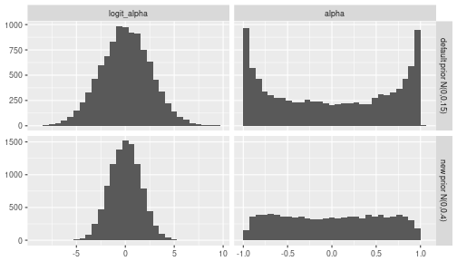
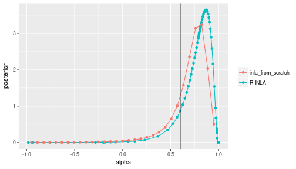
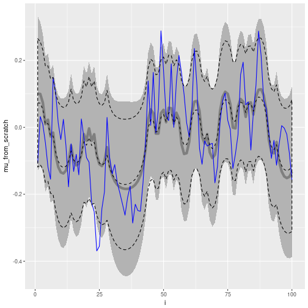

# Introduction

This report is my attempt to implement the INLA methodology for Bayesian inference without using the corresponding R package `INLA`.
The motivation is to understand the method in more detail, and to make the R package less of a black box.
I have not found similar reports online, so hopefully this will be useful for new users of INLA who are interested in looking behind the scenes.


# Load libraries


```r
library(Matrix)
library(tidyverse)
```

```
## Loading tidyverse: ggplot2
## Loading tidyverse: tibble
## Loading tidyverse: tidyr
## Loading tidyverse: readr
## Loading tidyverse: purrr
## Loading tidyverse: dplyr
```

```
## Conflicts with tidy packages ----------------------------------------------
```

```
## expand(): tidyr, Matrix
## filter(): dplyr, stats
## lag():    dplyr, stats
```

```r
knitr::opts_chunk$set(
  cache.path='_knitr_cache/inla-from-scratch/',
  fig.path='figure/inla-from-scratch/'
)
```


# The model

Consider the case where we want to learn something about a time series that comes in the form of zeros and ones. 
Such a time series could occur as a record of rain/no rain on consecutive days, for example.
As is usual in time series data, we expect that consecutive values are correlated, and so the auto-correlation structure is a useful statistical property to infer from the time series.


To this end, we model the data by a two-stage process.
There is an unobserved latent process $x_1, ..., x_n$ that evolves with AR1 correlation

\begin{equation}
x_t = \alpha x_{t-1} + \sigma \epsilon_t
\end{equation}

where the $\epsilon_t$ are iid standard Normal variates.
The prior distribution for the first value $x_1$ is equal to the marginal distribution of the AR1 process, $N(0, \sigma^2 / (1 - \alpha^2))$.

The observations $y_1, ..., y_N$ are Bernoulli trials whose success probabilities $p_1, ..., p_n$ change over time, and are related to the latent process $x_t$ through a logit link:

\begin{equation}
p_t = \frac{\exp(\beta x_t)}{1 + \exp(\beta x_t)}
\end{equation}

We refer to the hyperparameters $\{\alpha, \beta, \sigma\}$ collectively by $\theta$ and to their joint prior distribution as $p(\theta)$.


In the following simple example we will assume that $\beta$ and $\sigma$ are known.
The goal will be to infer the posterior distribution of the AR1 parameter $\alpha$ using the INLA approximation.


## The joint log-likelihood 

The conditional density of the observations given the latents and hyperparameters is given by

\begin{align}
\log p(y\vert x,\theta) & \propto \sum_t \left[ y_t \log(p_t) + (1 - y_t) \log(1 - p_t) \right] \newline
& = \sum_t \left[ \beta x_t y_t - \log(1 + \exp(\beta x_t)) \right]
\end{align}

The AR1 process $x_1, ..., x_n$ has a joint Normal distribution with zero mean and a sparse precision matrix $Q$ which we derive next.
Assuming that $x_1$ has prior distribution $N(0,\sigma^2 / (1-\alpha^2))$ and $x_2, ..., x_n$ have conditional distributions according to the AR1 model, the joint distribution of $x_1,...,x_n$ factorises as

\begin{align}
p(x_1, ..., x_n)  = &p(x_1) p(x_2 \vert  x_1) p(x_3 \vert  x_2) ... p(x_n \vert  x_{n-1})\newline
\propto & \exp -\frac{1}{2\sigma^2} \left[ x_1^2 (1 - \alpha^2) + (x_2 - \alpha x_1)^2 + (x_3 - \alpha x_2)^2 + ... + (x_n - \alpha x_{n-1})^2  \right]\newline
\propto & \exp -\frac{1}{2\sigma^2} \left[ x_1^2 - 2\alpha x_1 x_2 + x_2^2 (1 + \alpha^2) - 2 \alpha x_2 x_3 + x_3^2 (1 + \alpha^2) - ... \right. \newline
& \left. + x_{n-1}^2 (1 + \alpha^2) - 2 \alpha x_{n-1} x_n + x_n^2 \right]\newline
\propto & \exp -\frac{1}{2\sigma^2} \sum_{i,j} x_i Q_{ij} x_j
\end{align}

which is proportional to a multivariate Normal density with tridiagonal precision matrix $Q$ given by


\begin{equation}
Q = \frac{1}{\sigma^2} \left(\begin{matrix} 
1 & -\alpha &  &  &    \newline
-\alpha & 1 + \alpha^2 & -\alpha   & &  \newline
 & \ddots & \ddots & \ddots& \newline
   &  & -\alpha & 1 + \alpha^2 & -\alpha \newline
   &  &  & -\alpha & 1
\end{matrix}\right)
\end{equation}


The joint log-density of the observations, latents and hyperparamaters is thus given by 


\begin{align}
\log p(y,x,\theta) = & \log p(y\vert x,\theta) + \log p(x\vert \theta) + \log p(\theta) \newline
 \propto &\sum_t \left[ \beta x_t y_t - \log(1 + \exp(\beta x_t)) \right] + \frac12 \log\vert Q\vert  - \frac12 x'Qx + \log p(\theta)
\end{align}


## Simulated data

We simulate data with parameter settings $n=100$, $\alpha=0.6$, $\sigma=0.1$, and $\beta=10$:


```r
set.seed(1234)
n = 100
alpha_true = .6
sigma_true = 0.1
beta_true = 10

x = arima.sim(n=n, model=list(ar=alpha_true), sd=sigma_true) %>% as.numeric
p = 1 / (1 + exp(-beta_true * x))
y = rbinom(n, 1, p)
```

We plot the latent AR1 process $x$, the corresponding Bernoulli probabilities $p$, and the observed Bernoulli trials $y$:


```r
df = data_frame(i = 1:n, x = x, p = p, y = y) %>% 
     gather(key='variable', value='value', -i) %>%
     mutate(variable = factor(variable, levels=c('x','p','y'))) 
ggplot(df, aes(x=i, y=value, color=variable)) + 
  geom_line(na.rm=TRUE, show.legend=FALSE) + 
  facet_wrap(~variable, ncol=1, scales='free_y') + 
  xlim(0,100) + labs(x=NULL, y=NULL)
```


# INLA theory

INLA is a statistical inference framework that deals with models of the following form

**observations**: $p(y \vert x,\theta) = \prod_i p(y_i \vert x_i, \theta)$, observations are generally assumed to be from the exponential family

**latent variables**: $\log p(x\vert\theta) \propto \frac12 \log\vert Q(\theta)\vert - \frac12 x'Qx$ where $Q$ is a sparse matrix so $x$ is a Gauss Markov random field

**hyperparameters**: $\theta \sim p(\theta)$ is a small number of hyperparameters ($< 6$)


## Approximating the posterior $p(\theta \vert y)$

From the (slightly unusual) factorisation of the joint distribution

\begin{equation}
\log p(y,x,\theta) = \log p(x\vert\theta, y) + \log p(\theta\vert y) + \log p(y)
\end{equation}

we get the following expression for the posterior of the hyperparameters

\begin{equation}
\log p(\theta \vert y) \propto \log p(y,x,\theta) - \log p(x\vert y,\theta)
\end{equation}

The symbol $\propto$ is to be read as "equal up to an additive constant" when working with log-probabilities, and "equal up to a multiplicative constant" when working with probabilities.
The above expression is valid for arbitrary values of $x$ (with non-zero density).
A particularly choice of $x$ is to use the mode $x_0(\theta)$ of $\log p(y,x,\theta)$ at fixed values of $\theta$ and $y$.
Hence we will express the posterior of the hyperparameters as

\begin{equation}
\log p(\theta \vert y) \propto \left[ \log p(y,x,\theta) - \log p(x\vert y,\theta) \right]_{x=x_0(\theta)}
\end{equation}

This relationship can be used to obtain the posterior $p(\theta \vert  y)$ up to a multiplicative constant, so the result will have to be normalised so that the posterior density integrates to 1 over all $\theta$.
If the dimensionality of $\theta$ is small, normalisation is usually straightforward by numerical quadrature, using e.g. Simpson's rule.


The challenge is now to find a good approximation of the conditional distribution of the latent variables $p(x\vert y,\theta)$.
In the INLA methodology, $p(x\vert y,\theta)$ is approximated using the Laplace approximation.


We first define the function $f(x)$ which is proportional to the log joint $\log p(y,x,\theta)$ taken as a function of $x$, i.e. at fixed values of $y$ and $\theta$.
It should be emphasised that $f(x)$ is a different function for different choices of $\theta$ during the approximation of $p(\theta\vert y)$.
The conditional $p(x\vert y,\theta)$ can always be expressed through $f(x)$ by

\begin{equation}
p(x\vert y,\theta) = \frac{\exp[f(x)]}{\int dx \exp[f(x)]}
\end{equation}

Integrals of the form $\int dx e^{f(x)}$ can be approximated by the Laplace approximation:

\begin{equation}
\int dx \exp[f(x)] \approx \exp[f(x_0)] (2\pi)^{n/2} \big\vert -Hf(x_0)\big\vert ^{-1/2}
\end{equation}

where $x_0$ is the mode of $f(x)$, $Hf(x_0)$ is the Hessian matrix of $f$ evaluated at the mode, and $n$ is the dimensionality of $x$.

In our latent AR1 example, the function $f(x) \propto \log p(y,x,\theta)$ is given by

\begin{equation}
f(x) = \sum_t [\beta x_t y_t - \log ( 1 + \exp(\beta x_t))] - \frac12 x'Qx
\end{equation}

The gradient and Hessian of $f$ are given by

\begin{align}
\nabla f (x) & = vec\left[ \beta y_i - \frac{\beta \exp(\beta x_i)}{1+\exp(\beta x_i)}\right] - Qx\newline
Hf(x) & = - Q - diag\left[ \frac{\beta^2 \exp(\beta x_i)}{(1+\exp(\beta x_i))^2} \right]
\end{align}


## Calculating the mode $x_0$

The function $f(x)$ can generally be written as

\begin{equation}
f(x) = -\frac12 x'Qx + \sum_i g_i(x_i)
\end{equation}

We Taylor expand $f(x)$, only keeping those additive terms that depend on $x$:

\begin{align}
f(x) & \approx f(x_0) + \nabla f(x_0) (x-x_0) + \frac12 (x-x_0)' Hf(x_0) (x-x_0)\newline
& \propto [ \nabla f (x_0) - x_0' Hf(x_0) ] x + \frac12 x' Hf(x_0) x
\end{align}

where $\nabla f$ and $Hf$ are gradient vector and Hessian matrix of $f(x)$.

The Taylor expansion approximates $f(x)$ by a parabola through $x_0$.
The mode of the parabola is given by setting the first derivative to zero and solving for $x$, i.e. the mode is given by the solution to the equation

\begin{align}
[Q - diag\; g''_i(x_0)] x = vec\; g'_i(x_0) - x_0' diag\; g''_i(x_0)
\end{align}

The solution provides a new improved estimate of the mode of $f(x)$.
The mode of $f(x)$ is found iteratively.


# R functions

We assume $\beta=10$ and $\sigma = 0.1$ are known, and the unknown parameter to be inferred is the AR1 parameter $\alpha$.

We next define the necessary R functions.

## The precision matrix $Q$


```r
calc_Q = function(alpha) {
  1 / sigma_true^2 * Matrix::bandSparse(n, k=0:1, 
    diagonals = list(c(1, 1 + alpha^2, 1) %>% rep(c(1, n-2, 1)), 
                     -alpha %>% rep(n-1)), 
    symmetric=TRUE)
}
```


## The log prior for $\alpha$

The AR1 coefficient is between -1 and 1. We assume a beta prior for $(\alpha + 1) / 2$.


```r
calc_lprior = function(alpha, a=1, b=1) {
  (a-1) * log((alpha + 1) / 2) + (b-1) * log(1 - (alpha+1)/2)
}
```


## The log joint distribution $p(y,x,\theta)$

To calculate the determinant of $Q$ from its Cholesky decomposition $Q = L'L$ ($L$ is an upper triangular matrix), we use the identity $\vert Q\vert  = \prod L_{ii}^2$ and equivalently $\log \vert Q\vert  = 2 \sum_i \log L_{ii}$:


```r
calc_ljoint = function(y, x, alpha, sigma=0.1, a=1, b=1) {
  chol_Q = calc_Q(alpha) %>% chol
  logdet_Q_half = chol_Q %>% diag %>% log %>% sum
  quad_form = crossprod(chol_Q %*% x) %>% drop
  res = 
    sum(beta_true * x * y - log1p(exp(beta_true * x))) + 
    logdet_Q_half - 0.5 * quad_form + 
    calc_lprior(alpha, a, b)
  return(res)
}
```

## The function $f(x)$, its gradient and its (negative) Hessian


```r
calc_ff = function(x, alpha) {
  sum(beta_true * x * y - log1p(exp(beta_true * x))) - 
  0.5 * drop(as.matrix(x %*% calc_Q(alpha) %*% x))
}

calc_grad_ff = function(x, alpha) {
  beta_true * y - 
  beta_true * exp(beta_true * x) / (1 + exp(beta_true * x)) - 
  drop(as.matrix(calc_Q(alpha) %*% x))
}

calc_neg_hess_ff = function(x, alpha) {
  calc_Q(alpha) + 
  diag(beta_true^2 * exp(beta_true * x) / (1 + exp(beta_true * x))^2)
}
```

## Calculate the mode of $f(x)$


```r
# the function g(x) = log(p(y\vert x,theta))
calc_g0 = function(x) {
  sum(beta_true * x * y - log1p(exp(beta_true * x)))
}
# the gradient of g(x) 
calc_g1 = function(x) {
  beta_true * y - beta_true * exp(beta_true * x) / (1 + exp(beta_true * x)) 
}
# the diagonal of the hessian of g(x)
calc_g2 = function(x) {
  (-1) * beta_true^2 * exp(beta_true * x) / (1 + exp(beta_true * x))^2
}

calc_x0 = function(alpha, tol=1e-12) {
  Q = calc_Q(alpha)
  x = x0 = rep(0, n)
  while(1) {
    g1 = calc_g1(x)
    g2 = calc_g2(x)
    x = drop(solve(Q - bandSparse(n=n, k=0, diagonals=list(g2))) %*% 
             (g1 - x0 * g2))
    if (mean((x-x0)^2 < tol)) {
      break
    } else {
      x0 = x
    }
  }
  return(x)
}
```


Here is a brute force optimisation using the built-in R function `optim`, which is 10 times slower than the iterative method above:


```r
calc_x0_brute = function(alpha) {
  optim(par=rep(0, n), fn=calc_ff, gr=calc_grad_ff, alpha=alpha, 
        control=list(fnscale=-1), method='BFGS')$par
}
```


```r
# x0_fast = calc_x0(0.5)
# x0_brute = calc_x0_brute(0.5)
# cbind(fast=x0_fast, brute=x0_brute) %>% round(digits=4) %>% head(n=5)
```


```r
cbind(fast = calc_ff(x0_fast, 0.5), brute = calc_ff(x0_brute, 0.5))
```

```
## Error in calc_ff(x0_fast, 0.5): object 'x0_fast' not found
```

The iterative and built-in method yield the same results.

## Approximating the log posterior up to an additive constant 

With the above functions, approximating $\log p(\theta\vert y)$ up to an additive constant is straightforward:


```r
calc_lpost = function(alpha) {
  x0 = calc_x0(alpha)
  chol_h = chol(calc_neg_hess_ff(x0, alpha))
  calc_ljoint(y, x0, alpha) - sum(log(diag(chol_h)))
}
```


## Normalisation of the posterior

Once $p(\theta\vert y)$ is approximated up to a constant, we can use numerical integration such as Simpson's rule to find the normalisation constant.
Here is an implementation of one version called *composite Simpson's rule*:


```r
calc_Z = function(alpha_vec, lpost_vec) {
  nn = length(alpha_vec)
  hh = alpha_vec[2] - alpha_vec[1]
  ww = c(1, rep(c(4,2), (nn-3)/2), c(4,1))
  return(sum(ww * exp(lpost_vec)) * hh / 3)
}
```


# INLA from scratch

At this point, approximation of the unnormalised log posterior of $\alpha$ is a simple matter of an `sapply` call, and the normalisation constant can be approximated subsequently:


```r
alpha_vec = seq(-.95, .95, len=31)
lpost = sapply(alpha_vec, calc_lpost) 
lpost = lpost - mean(lpost) # to avoid numerical overflow
Z = calc_Z(alpha_vec, lpost)
```

We plot the unnormalised log-posterior and the normalised posterior:


```r
df_posterior = 
  bind_rows(
    data_frame(alpha=alpha_vec, posterior=lpost, 
               type='unnormalised_log_posterior'),
    data_frame(alpha=alpha_vec, posterior=exp(lpost)/Z, 
               type='normalised_posterior')) %>% 
  mutate(type = factor(type, levels=c('unnormalised_log_posterior', 
                                      'normalised_posterior')))
ggplot(df_posterior, aes(x=alpha, y=posterior)) + 
  geom_line() + geom_point() +
  geom_vline(aes(xintercept=alpha_true), linetype='dashed') + 
  facet_wrap(~type, scale='free_y', ncol=1) +
  theme(legend.position='none')
```


# R-INLA

We now use the R package `INLA` to infer the posterior $p(\alpha\vert y)$.

## The AR1 parametrisation in R-INLA

In R-INLA, the AR1 latent model is parametrised through the parameters $\theta_1$ and $\theta_2$.
$\theta_1$ is the log marginal precision of the AR1 process, i.e. using our notation $\theta_1 = \log[ (1 - \alpha^2) / \sigma^2]$.
Since we only want to infer the AR1 parameter $\alpha$, we fix $\theta_1$ at its true value in the R-INLA prior specification.
The parameter $\theta_2$ is the logit transformed AR1 parameter, i.e. using our notation $\theta_2 = \log[ (1+\alpha) / (1-\alpha) ]$.
R-INLA specifies a Normal prior for $\theta_2$, whereas we have specified a uniform (Beta(1,1)) prior for $\alpha$.


## On the R-INLA default prior for $\alpha$

It is worthwhile to have a look at the default $N(0,1/0.15)$ prior for $logit(\alpha)$ used by R-INLA.
Judging from the figure below, this is a rather curious choice for a default prior, as it will strongly bias the posterior of $\alpha$ away from zero, towards +1 and -1.
Based on exploratory analysis, we will choose a different prior for $\theta_1$, namely $N(0, (1/0.5))$ which roughly yields a uniform distribution over $\alpha$:


```r
df_prior = 
  bind_rows(
    data_frame(logit_alpha = rnorm(1e4,0,sqrt(1/0.15)), 
               type='default prior N(0,0.15)'), 
    data_frame(logit_alpha = rnorm(1e4,0,sqrt(1/0.4)), 
               type='new prior N(0,0.4)')) %>% 
  group_by(type) %>% 
  mutate(alpha = (exp(logit_alpha)-1)/(exp(logit_alpha) + 1)) %>%
  ungroup %>%
  gather(key='transformation', value='value', -type) %>%
  mutate(transformation = factor(transformation, levels=c('logit_alpha', 'alpha'))) 

ggplot(df_prior, aes(x=value)) + 
  geom_histogram(bins=30) + 
  facet_grid(type ~ transformation, scale='free') +
  labs(x=NULL, y=NULL)
```




## The R-INLA implementation


```r
library(INLA)
```

```
## Loading required package: sp
```

```
## Loading required package: methods
```

```
## This is INLA_17.06.20 built 2017-09-07 09:01:27 UTC.
## See www.r-inla.org/contact-us for how to get help.
```

```r
theta1_true = log((1-alpha_true^2)/sigma_true^2) 
theta2_param = c(0, 0.4)
A_mat = diag(beta_true, n, n) %>% inla.as.sparse

inla_formula = 
  y ~ -1 + 
      f(i, model='ar1', hyper=list(
        theta1 = list(fixed=TRUE, initial=theta1_true),
        theta2 = list(param=theta2_param)))
inla_data = data_frame(i=1:n, y=y)

res = inla(
  formula=inla_formula, 
  data=inla_data, 
  family='binomial', 
  Ntrials=rep(1,n), 
  control.predictor=list(A = A_mat)
)
```

```
## Note: method with signature 'Matrix#numLike' chosen for function '%*%',
##  target signature 'dgTMatrix#numeric'.
##  "TsparseMatrix#ANY" would also be valid
```

```
## Note: method with signature 'sparseMatrix#matrix' chosen for function '%*%',
##  target signature 'dgTMatrix#matrix'.
##  "TsparseMatrix#ANY" would also be valid
```


```r
df_compare = bind_rows(
  res$marginals.hyperpar$`Rho for i` %>% 
    as_data_frame %>%
    rename(alpha=x, posterior=y) %>%
    mutate(type='R-INLA'),
  data_frame(alpha=alpha_vec, posterior=exp(lpost) / Z) %>% 
    mutate(type='inla_from_scratch')
)
ggplot(data=df_compare, mapping=aes(x=alpha, y=posterior, colour=type)) + 
  geom_line() + geom_point() +
  geom_vline(aes(xintercept=alpha_true)) + 
  labs(color=NULL)
```




# Inferring the latent variable $x_t$


```r
alpha_vec = seq(-.95, .95, len=31)
post_x = lapply(alpha_vec, function(alpha_) {
  x0_ = calc_x0(alpha_)
  chol_H_ = chol(calc_neg_hess_ff(x0_, alpha_))
  return(list(
    alpha = alpha_, 
    x0 = x0_,
    diag_sigma = drop(diag(chol2inv(chol_H_))),
    unn_log_post = calc_ljoint(y, x0_, alpha_) - sum(log(diag(chol_H_)))
  ))
})

mu = sapply(post_x, `[[`, 'x0')
sigma2 = sapply(post_x, `[[`, 'diag_sigma')

lpost = sapply(post_x, `[[`, 'unn_log_post')
post_alpha = exp(lpost) / calc_Z(alpha_vec, lpost)
w = post_alpha / sum(post_alpha)

mu_post = sapply(1:n, function(ii) weighted.mean(mu[ii,], w=w))
sigma_post = 
  sapply(1:n, function(ii) 
    weighted.mean((mu[ii,] - mu_post[ii])^2 + sigma2[ii,], w=w)
  ) %>% 
  sqrt

df_latent = data_frame(
  i=1:n, 
  mu_from_scratch = mu_post, 
  lwr_from_scratch = mu_post - 2 * sigma_post, 
  upr_from_scratch = mu_post + 2 * sigma_post, 
  mu_rinla = res$summary.random$i[,'mean'],
  lwr_rinla = with(res$summary.random$i, mean - 2 * sd),
  upr_rinla = with(res$summary.random$i, mean + 2 * sd),  
  x_true = x)

ggplot(df_latent, aes(x=i)) + 
  geom_ribbon(aes(ymin=lwr_from_scratch, ymax=upr_from_scratch), 
              fill='gray70') + 
  geom_line(aes(y=mu_from_scratch), col='gray50', lwd=2) + 
  geom_line(aes(y=x_true), color='blue') + 
  geom_line(aes(y=mu_rinla), linetype='dashed') + 
  geom_ribbon(aes(ymin=lwr_rinla, ymax=upr_rinla), fill=NA, 
              color='black', linetype='dashed')
```




# Conclusions

INLA is an efficient method for approximate Bayesian inference in latent Gaussian models with sparse dependency structure.

We were able to calculate a reasonable posterior distribution of the autocorrelation parameter of an AR1-Bernoulli process. 

However, the result of R-INLA is slightly different. 
In a couple of exploratory analyses with different parameter values and sample sizes, the "from scratch" method implemented here tends to assign higher posterior density to the true value than R-INLA. 


