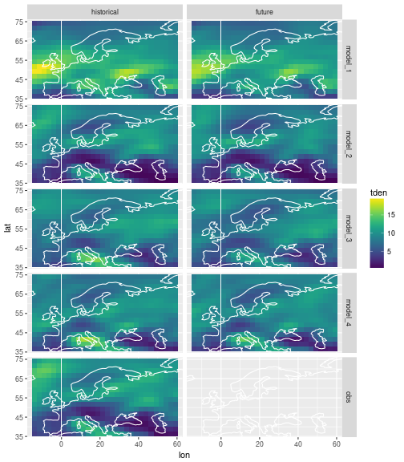
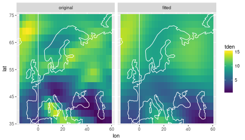
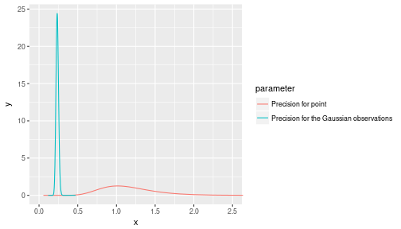
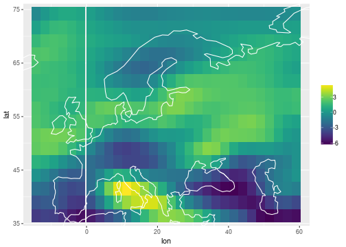

# Strom track density


```r
suppressPackageStartupMessages(library(tidyverse))
suppressPackageStartupMessages(library(INLA))
library(viridis)
```

```
## Loading required package: viridisLite
```

```r
library(rnaturalearth)
library(stringr)
knitr::opts_chunk$set(
  cache.path='_knitr_cache/storm-tracks/',
  fig.path='figure/storm-tracks/'
)
```


To plot maps, we use coastlines from the `rnaturalearth` data set:


```r
coast = ne_coastline(scale=110) %>% fortify %>% as_data_frame
```

The data we are looking at are spatial fields of storm track density (number of storms that pass through an area).
We have data from 4 climate models that have simulated past and future climate.
We also have historical observation data.
The area we are looking at is (roughly) Europe and the season is winter (DJF).


```r
load('data/storm-track-density.Rdata')
storms
```

```
## # A tibble: 4,320 x 5
##         lat        lon   model experiment     tden
##       <dbl>      <dbl>  <fctr>     <fctr>    <dbl>
##  1 36.47029 -14.161041 model_1 historical 4.460165
##  2 36.47029 -11.645844 model_1 historical 4.388444
##  3 36.47029  -9.130646 model_1 historical 4.148048
##  4 36.47029  -6.615448 model_1 historical 3.544464
##  5 36.47029  -4.100250 model_1 historical 3.052784
##  6 36.47029  -1.585052 model_1 historical 2.820646
##  7 36.47029   1.257596 model_1 historical 3.032609
##  8 36.47029   3.772789 model_1 historical 3.530901
##  9 36.47029   6.287981 model_1 historical 4.269177
## 10 36.47029   8.803174 model_1 historical 5.247809
## # ... with 4,310 more rows
```


```r
summary(storms)
```

```
##       lat             lon              model          experiment  
##  Min.   :36.47   Min.   :-14.161   model_1:960   historical:2400  
##  1st Qu.:45.90   1st Qu.:  3.773   model_2:960   future    :1920  
##  Median :55.33   Median : 22.637   model_3:960                    
##  Mean   :55.33   Mean   : 22.571   model_4:960                    
##  3rd Qu.:64.77   3rd Qu.: 41.501   obs    :480                    
##  Max.   :74.20   Max.   : 59.107                                  
##       tden        
##  Min.   : 0.2943  
##  1st Qu.: 6.9245  
##  Median : 8.9311  
##  Mean   : 8.6013  
##  3rd Qu.:10.5322  
##  Max.   :19.6039
```


```r
ggplot(data=storms) + 
  geom_tile(mapping=aes(x=lon, y=lat, fill=tden)) + 
  facet_grid(model ~ experiment) + 
  scale_fill_viridis() + 
  coord_cartesian(xlim = range(storms$lon), ylim=range(storms$lat)) +
  geom_path(data=coast, aes(x=long, y=lat, group=group), col='white') +
  labs(fill = 'storm\ntrack\ndensity')
```



The ultimate goal is to use all the model data and the observations to fill in the blank field for the future observations, calculating both a best guess estimate as well as uncertainty information.


## Smoothing a spatial field with R-INLA

As a preliminary, we will use R-INLA decompose a single spatial field into a smooth field represented by a 2-dimensional random walk, and a random component represented by independent Gaussian noise.

The 2d random walk is a generalisation of the 1d random walk, where the value $x_{i,j}$ at the gridpoint $(i,j)$ is given by the average of its nearest neighbours plus independent Normal noise with zero mean and precision $\tau$, i.e.

\begin{equation}
(x_{i+1,j} + x_{i-1,j} + x_{i,j+1} + x_{x,j-1}) - 4x_{i,j} \sim N(0, \tau^{-1})
\end{equation}

The precision parameter $\tau$ acts as a smoothness parameter.
The higher $\tau$, the less will $x_{i,j}$ differ from the average over its neighbors, and thus the smoother will be the 2d field. 

In R-INLA, the [2d random walk model](http://www.math.ntnu.no/inla/r-inla.org/doc/latent/rw2d-model.pdf) is specified as follows:


```r
nlon = select(storms, lon) %>% unique %>% nrow
nlat = select(storms, lat) %>% unique %>% nrow

inla_formula = tden ~ 1 + 
  f(point, model='rw2d', nrow=nlat, ncol=nlon)
```

The 2d random walk model in INLA only applies to data on a rectangular grid.
The 2d field must be saved as a vector in which the columns of the matrix are stacked on top of each other.
Our data frame `storms` has track density already in this format, since longitudes change fastest and latitudes change slowest as you go down the data frame.
So it is straightforward to create the INLA data frame.
We will only work with the field of historical observations for now.


```r
inla_data = storms %>%
  filter(experiment == 'historical', model == 'obs') %>%
  select(lon, lat, tden) %>%
  mutate(point = 1:(nlon*nlat))
```

We run INLA with the option `control.predictor=list(compute=TRUE)` because we want to extract fitted values later:


```r
inla_out = inla(formula=inla_formula, data=inla_data, 
                control.predictor=list(compute=TRUE, link=1))
```


```r
df = inla_data %>% 
  rename(original = tden) %>%
  mutate(fitted = inla_out$summary.fitted.values$mean) %>%
  gather(key='key', value='tden', original, fitted) %>%
  mutate(key = factor(key, levels=c('original', 'fitted')))

ggplot(data=df) + 
  geom_tile(mapping=aes(x=lon, y=lat, fill=tden)) + 
  facet_wrap(~ key) + 
  scale_fill_viridis() + 
  coord_cartesian(xlim = range(storms$lon), ylim=range(storms$lat)) +
  geom_path(data=coast, aes(x=long, y=lat, group=group), col='white') +
  labs(fill = 'storm\ntrack\ndensity')
```



The fitted values are smoother than the original.
It is possible to specify a fixed value for the precision parameter of the random walk to control the smoothness.
Here the precisions of the 2d random walk and the Gaussian residuals were both estimated by INLA; here are their posteriors:


```r
df = inla_out$marginals.hyperpar %>% map(as_data_frame) %>% bind_rows(.id='parameter')
ggplot(data=df, aes(x=x, y=y, color=parameter)) + geom_line() + coord_cartesian(xlim=c(0, 2.5))
```




## Inferring common and individual components


```r
inla_formula = tden ~ -1 + 
  f(i_rw_common, model='rw2d', nrow=nlat, ncol=nlon) +
  f(i_bias, model='iid', replicate=repl) +
  f(i_rw_indiv, model='rw2d', nrow=nlat, ncol=nlon, replicate=repl)
```
 

```r
n = nlon * nlat
m = storms %>% select(model) %>% unique %>% nrow
inla_data = storms %>% 
  filter(experiment == 'historical') %>%
  select(lon, lat, tden) %>%
  mutate(i_rw_common = rep(1:n, m)) %>%
  mutate(i_bias = rep(1:m, each=n)) %>%
  mutate(i_rw_indiv = rep(1:n, m)) %>%
  mutate(repl = rep(1:m, each=n))
```


```r
inla_out = inla(formula=inla_formula, data=inla_data)
```


```r
lonlat = inla_data %>% 
  filter(repl == 1) %>%
  select(lon, lat)
df = bind_cols(
  lonlat,
  inla_out$summary.random$i_rw_common %>% as_data_frame
) %>% 
select(lon, lat, mean)
```


```r
ggplot(data=df) + 
  geom_tile(mapping=aes(x=lon, y=lat, fill=mean)) + 
  scale_fill_viridis() + 
  coord_cartesian(xlim = range(storms$lon), ylim=range(storms$lat)) +
  geom_path(data=coast, aes(x=long, y=lat, group=group), col='white') +
  labs(fill = NULL)
```


